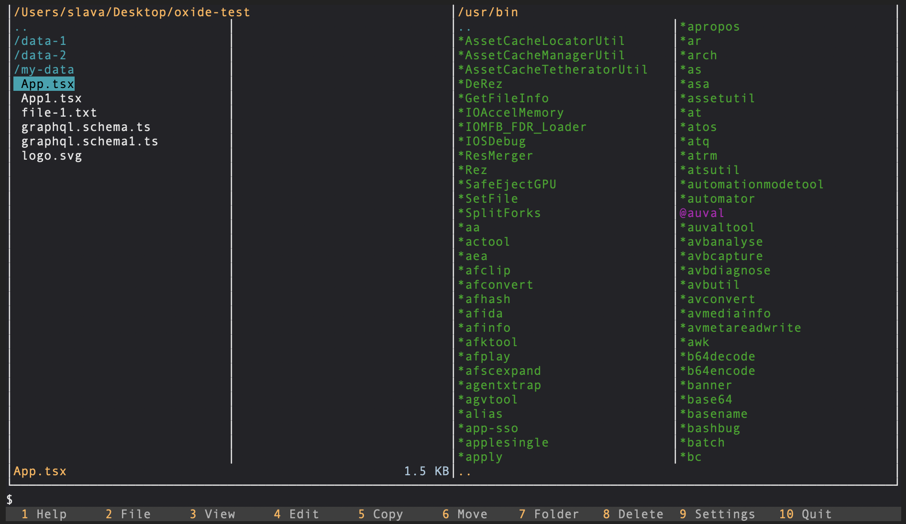

# Oxide

**xd** — A TUI file manager in the style of Midnight Commander. Built with Rust, Ratatui, and Crossterm.

## Overview

Oxide is a terminal user interface (TUI) file manager with a dual-panel layout. The compiled binary is named **xd**. For background on the project and technical choices, see [the intro article](doc/articles/intro.md).



> **Warning:** This is a **pilot** build. It has **not** been fully tested end-to-end, and it may contain bugs or rough edges. So far it has seen real use only from the author—mostly on **macOS**, with lighter use on **Linux**. Be careful with important files and production workflows until you are comfortable with how it behaves.

### Features

See [FEATURES.md](doc/FEATURES.md) for a full list of features and key bindings.

## Build

For Linux (Debian/Ubuntu), see [BUILD_LINUX.md](doc/BUILD_LINUX.md) for system dependencies and build flow.

### Prerequisites

- [Rust](https://www.rust-lang.org/tools/install) (edition 2021)
- On Unix: `libc`, `nix` (for permissions, subshell PTY)

For theory on the subshell, PTY, terminals, and file descriptors, see [SHELL_PTY_TERMINAL.md](doc/SHELL_PTY_TERMINAL.md).

### Alternative manifest (`Cargo.old.toml`)

The default [Cargo.toml](Cargo.toml) tracks current dependency versions. If you are on **older hardware** or a **restricted toolchain** where those versions do not build or run well, use [Cargo.old.toml](Cargo.old.toml) instead: it pins **older, more conservative** dependency versions for the same crate.

Replace the manifest and build as usual (keep a backup of [Cargo.toml](Cargo.toml) if you need to switch back):

```bash
cp Cargo.toml Cargo.toml.bak && cp Cargo.old.toml Cargo.toml
cargo build --release
```

To restore the default dependency set: `cp Cargo.toml.bak Cargo.toml` (or `git checkout -- Cargo.toml` if you have not committed the swap).

### Build commands

```bash
# Build debug binary
cargo build

# Build release binary (optimized)
cargo build --release

# Build and run
cargo run
cargo run --release
```

### Output

- Debug: `target/debug/xd`
- Release: `target/release/xd`

### Install (optional)

```bash
cargo install --path .
# Installs xd to ~/.cargo/bin
```

### Portable tarball installer (Linux & macOS)

The repo includes a POSIX shell installer and a helper script that packages the release binary plus `install.sh` into a gzip-compressed tarball.

**Create a release archive** (run on the OS and CPU architecture you want to ship; the archive name includes `uname` output, e.g. `linux-x86_64` or `darwin-arm64`):

```bash
./scripts/make-dist.sh
```

This runs `cargo build --release` and writes `dist/xd-<version>-<os>-<arch>.tar.gz` (the `dist/` directory is gitignored).

**Install from the tarball** on the target machine:

```bash
tar xzf xd-0.1.0-linux-x86_64.tar.gz   # use the file name you built or downloaded
./install.sh
```

By default, `install.sh` copies `xd` into `$HOME/.local/bin` when that directory is writable; otherwise it uses `/usr/local/bin` and may invoke `sudo`. Override the destination:

```bash
./install.sh -p /path/to/bin
# or
PREFIX=/path/to/bin ./install.sh
```

**Install a local release build without packaging:**

```bash
cargo build --release
./install/install.sh -p "$HOME/.local/bin" target/release/xd
```

To create a Debian (.deb) package, see [PACKAGING_DEB.md](doc/PACKAGING_DEB.md).

## Usage

```bash
xd
```

See [FEATURES.md](doc/FEATURES.md) for key bindings and feature details.

For Rust crate dependencies and Cursor / AI assistant skills (vendored and project-local), see [DEPENDENCIES_AND_SKILLS.md](doc/DEPENDENCIES_AND_SKILLS.md).

## License

[LICENSE](LICENSE) — MIT License.
