# Intro

My first brush with a PC was two blue Norton Commander panels in 1991. Back then, it felt like magic.

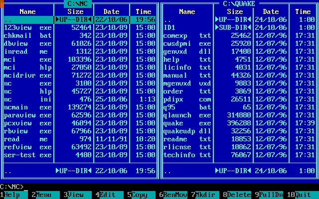

Time went on…

> Fortran, Clarion, FoxPro, Pascal, Smalltalk, C, Oracle, Java, Postgres, Node.js, TypeScript, Rust…  
> MS-DOS, Windows, Linux, macOS…  
> Norton Commander, Far Manager, Midnight Commander…

Thirty-plus years of code, wins and flops, companies, coworkers, and screens, and those blue panels never really left the picture.

I’m older now and pickier. When I miss a feature I actually care about, I can fix it the hard way. I’m not about to rewrite a database or an OS, but for tools and utilities? That’s a different story.

So, when the macOS build of Midnight Commander randomly hangs for five seconds, or I have to hit Ctrl+O one time too many, I finally stopped shrugging it off. I wanted something like MC: maybe simpler, but fast, and shaped the way I work, for myself. I did not go straight to building my own from scratch. First, I did a quick sweep for good alternatives, and that search is what showed there isn’t really a console file manager with the same mix of popularity and depth on macOS or on Linux. Windows, I’ll skip for now; I don’t live there day to day, and Far Manager already exists.

Here are a few questions that stuck with me after that search:

1. What if it weren’t just for Linux and macOS?  
2. What if we built for today’s hardware and kept up when that hardware changed, instead of leaving the design pegged to what machines were like decades ago?  
3. What if we kept the classic idea but folded in some fresh UI/UX?  
4. What if the thing were built in a language from the 21st century, not the 20th?

If you’ve read this far, you’ve probably guessed: I decided to build something new. Those questions are the motivation and the rough roadmap.

The stack is **Rust**, a systems programming language at heart. I won’t give the full sales pitch. It learns from what went wrong before, fixes whole classes of old mistakes more squarely than most alternatives, and still carries forward the good ideas from earlier generations. On top of that, it’s built for real systems work: memory-safe without a garbage collector, fast, and practical for desktop and CLI apps, not just slides and benchmarks.

There’s also a great community and a rich crate ecosystem. For the console UI, I went all-in on [Ratatui](https://ratatui.rs/). It’s a joy: a mature, batteries-included TUI toolkit (layouts, widgets, styling, the works) that feels like building a real UI instead of hand-drawing escape codes. It sits on solid terminal backends, and the docs and examples actually help, and the project is alive, which is exactly what you want when you’re not writing a toy demo.

So, meet **Oxide**. The name is a nod to the Rust ecosystem.

I built it with AI in the loop, and it turned out better than I expected. That’s why I’m sharing it with you.

Next up: a set of stories, almost little novellas, each one a concrete use case that shows why this thing exists and how it behaves in practice. I hope you’ll read them like vignettes, not a manual.

---

## Switching between the command line and the panels

### The problem

Picture this: you’ve typed a long command, then you realize you need to open a file somewhere else, outside the current panel paths, to double-check a name, a path, or some value before you run it.

### How Midnight Commander handles it

You’d normally use `Enter` to move into folders and open files. But with focus on the command line, `Enter` means “run the command.” So, you can’t freely browse the tree and edit the command in one breath: the same key is wired to two different jobs. Typical two-panel managers also steer most keys either toward the line or toward the list, but `Enter` is the painful overlap; you’re stuck choosing between executing and navigating.

### How Oxide handles it

**Command-line focus** and **panel focus** are explicit states. Start typing a command-like character (a letter, digit, etc.), and it goes into the prompt, and the app switches to **command-line mode**. Need the panels? Press `Esc`: you’re back on the file list; browse, open the file, verify whatever you needed. Press `Esc` again and you return to the command line with your text and cursor intact. Arrow keys work in command-line mode for editing. No more fighting `Enter` just to peek at a file mid-command.

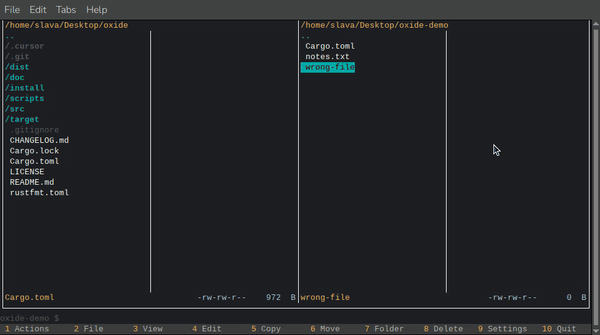

Maybe you’re wondering why the file names show up so fast in the clip above. That’s on purpose: in **command-line mode**, `F12` inserts the **currently selected file name** from the active panel at the cursor, which is handy when you’re building a command and don’t want to retype paths by hand.

## Time to read the command output

### The problem

You run something from the prompt, and the **output** is what matters: you want a moment (or more) to read it before the twin panels take over the screen again.

### How Midnight Commander handles it

People usually fall into one of two habits. `Ctrl+O` first to hide the panels and get a clean terminal, then run the command. Or run with the UI as-is and, afterward, hit `Ctrl+O` again to flip between the shell buffer and the file panes. It works, but you’re often **toggling** instead of getting a deliberate pause.

### How Oxide handles it

There’s a setting, **Auto reopen panels after command/executable** (`F9 → General settings`), that changes what happens after the command finishes.

- `On`: Oxide waits for a **configurable delay** (seconds) while you stay on the shell output; a small countdown appears at the **bottom-left** of the terminal. When the timer ends, the panels come back. No rush to read the first screenful.
- `Off`: Closer to classic MC: the output stays up until you decide to return; `Ctrl+O` brings the panels back when you’re ready.

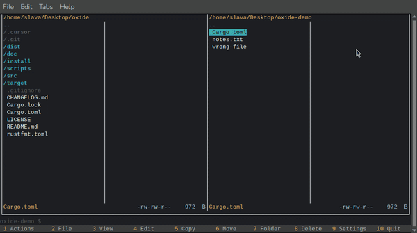

## Copy and move without the options dialog

### The problem

You’ve already got **source** and **target** in front of you: the two panels show the directories, and your selection is what you want to transfer. Stopping at another screen to re-type or re-confirm paths feels like **extra work** on the common path.

### How Midnight Commander handles it

**F5** (copy) and **F6** (move) open a **dialog first**: you can adjust source and target, filters, and other options before anything runs. That flexibility is real, but when the panels already match your intent, it’s another **round of keys** every time.

### How Oxide handles it

Keyboard `F5` and `F6` use the **active** and **opposite** panel paths and your **current selection**; the operation starts without that intermediate form. You still get the usual **overwrite** and **error** prompts when something collides mid-run.

**Mouse:** choosing **Copy** or **Move** from the **menu bar** still opens a short confirmation (with paths), so a slip of the pointer doesn’t start a large transfer by accident.

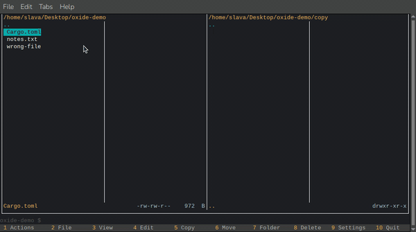

## File group selection

### The problem

You often need a **hand-picked set** of files, not just one row under the cursor, for copy, move, or size checks. It should be obvious which lines are in the set, and the keys should work on Mac keyboards too, not only on layouts with a dedicated `Insert` key.

### How Midnight Commander handles it

`Insert` toggles the mark on the current file (you can use the **mouse** as well). It’s a solid model on classic keyboards, but `Insert` is missing or awkward on many **Apple** machines, and **MC’s color scheme** as a whole (skins, directory styling, selected rows) often leaves **marked** files looking much like everything else, so the batch is easy to lose in the panel.

### How Oxide handles it

`Space` toggles the **mark** on the current row and moves **down** one line, with no **Insert** required. Marked entries get a `> ` prefix, so the group stays visually distinct.

**Ctrl+X** then **S** shows **combined size** for the same scope as `F5`/`F6`: all marked rows, or the single highlighted file when nothing is marked.

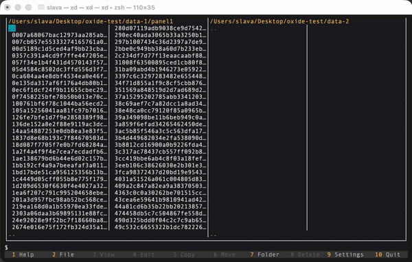

## Toggling hidden files

### The problem

Directories are full of **dotfiles** (**hidden** files or folders): config, caches, VCS metadata. Most of the time, they clutter the list, and you want them gone. Then, you’re debugging, editing a config, or hunting a `.env`, and you need them visible again, right now.

### How Midnight Commander handles it

The usual route is `F9 → Options → Panel options`, then find and flip `Show hidden files`. It works, but it’s several steps off the file list, with menu focus and wording you don’t touch every day, so it’s easy to fumble when you’re in a hurry.

### How Oxide handles it

The intuitive shortcut `Ctrl+X H` toggles **hidden files** for the **active panel** immediately; the listing refreshes in place.

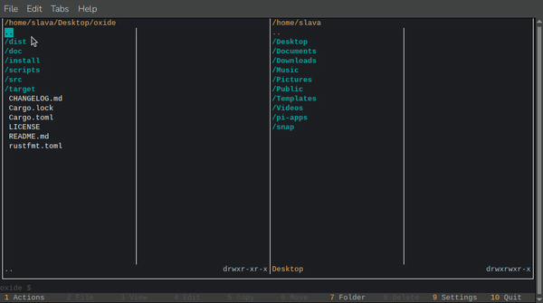

## Creating a new empty file

### The problem

You want an **empty file** with a chosen name in the directory the panel is showing (for config, text, notes, or whatever you open in an editor next), and you’d rather do it with a small dialog (pick the name, confirm) than by typing `touch` or another **command** in the file manager’s command line.

### How Midnight Commander handles it

Stock MC doesn’t give you a single shortcut for “create empty file here.” The usual habit is the command line: run `touch` with a name.

### How Oxide handles it

`Ctrl+X N` opens a short dialog: type the file name, `Enter` to create an **empty** file in the **active panel**’s current directory. `Esc` (or `Cancel`) backs out without touching the disk. If the name already exists, you get a clear error instead of a silent overwrite.

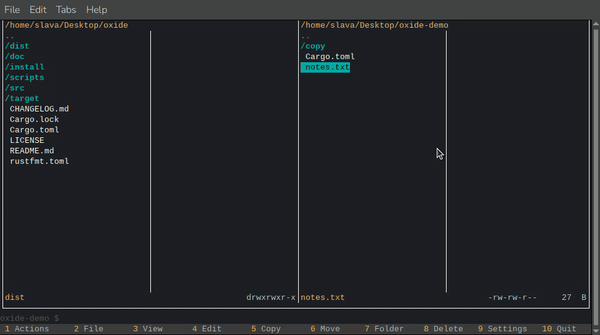

The same flow works when the **active panel** is **inside a ZIP** archive, not only on a normal filesystem folder.

## Creating a ZIP archive

### The problem

You’ve **marked** a set of files and folders and want a `.zip` in the current directory, without hand-writing **`zip`** flags in the command line every time.

### How Midnight Commander handles it

There’s no standard shortcut in stock **MC** that means “zip exactly what I’ve selected here.” People fall back on the command line (`zip`, `tar`, commands), or external tools. Same tradeoff as new file: powerful if you know the invocations, slower if you just want the archive **next to** the listing.

### How Oxide handles it

`Ctrl+X A` (with the **active panel** on a **filesystem** folder, not **inside** an open zip) opens the **archive** dialog: enter the `.zip` file name, `Enter` to start. Oxide packs the current selection (marked set, or the single highlighted row) into that archive and shows progress; the original files stay on disk, and you’re creating a **copy** into the zip, not moving them away.

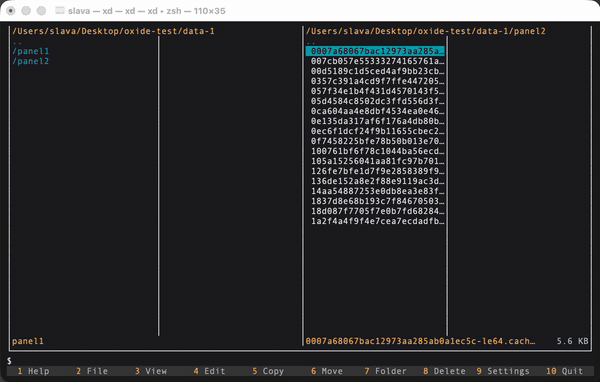

The clip below goes further: open the new archive in a panel like a folder, copy more files into it with `F5`, and use `Ctrl+X N` to add a new empty file inside the archive, using the same patterns as on a normal directory.

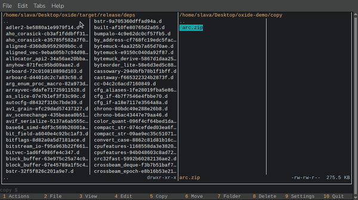

## Rename, mode, and ownership together

### The problem

You want to fix a file name and adjust Unix permissions (and often **owner** / **group**) in one go. When those jobs live in different places (rename here, `chmod` elsewhere), you make two round-trips and it’s easy to apply half the change.

### How Midnight Commander handles it

Rename usually goes through `F6 move`: you point the operation at the same directory and type a new name in the target field. That is powerful, but it’s still the **move** workflow. Mode and ownership are elsewhere: `F9 → File (or Command) → chmod / chown`-style dialogs, but it’s a separate trip through the menu.

### How Oxide handles it

`F2` opens **Rename / Attributes** on the **active panel**’s filesystem listing: one screen where you can edit the name, tick permission bits, and pick user and group. `Tab` cycles the focus between those areas; `Enter` applies the lot. If several files are marked, `F2` switches to **group** mode: **permissions** and **ownership** apply to **all** of them together (rename stays **single-file** only).

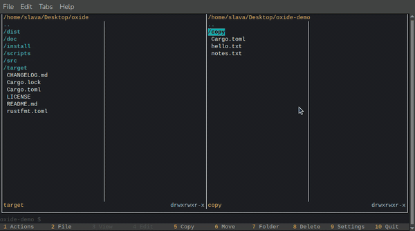

## Adaptive bottom menu

This one’s a bit of a fresh twist: the bottom row of `F-key` hints isn’t carved in stone. Some actions simply **don’t apply** to whatever you’ve got highlighted: `Edit` on a `folder`, `View` on something that isn’t a normal file, `Delete` when there’s **nothing real** to remove (hello, `..`), **Copy**/**Move** when both panels are sitting on the same path. Showing them all as if they worked would be misleading.

So, Oxide dims what you **can’t** use right now. The layout stays familiar; you get a straight read of what’s **on** vs **off** for this row and this panel.

Here’s a quick tour in motion:

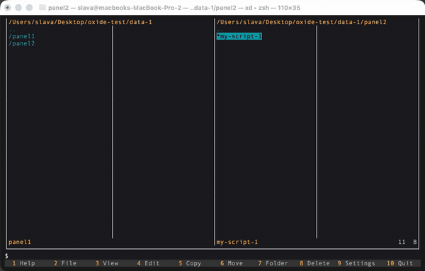

## Themes

A file manager is not only paths and shortcuts; it is something you look at for long stretches. I care about how the app looks in a real terminal—contrast, calm versus punch, whether the eye can rest—so Oxide ships with six built-in color themes. You pick one from `F9 → Theme`, and the choice is saved with the rest of your settings.

The preset names are a bit deliberate: not throwaway labels, but hooks for the kind of aside that fits a later chapter better than this one. If you are already curious about the intriguing names, that is by design. Here, I only wanted to flag the feature; the short story behind each theme is for the next episode.

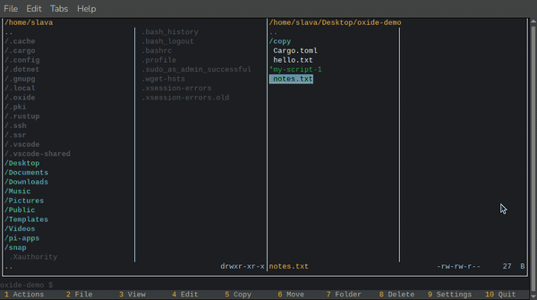

---

So, no: this isn’t the final word; it’s the first lap. **Oxide** is the name of the story, and everything above is still opening scenes: a few habits that annoyed me in the old two-panel world, and how this build tries to answer them without throwing away what worked.

There’s plenty left to tell: details you only notice after living in the app for a while, rough edges I keep sanding, and the occasional choice that looks odd until you see why it’s there. If any of this clicked with you, I’d be glad to share more as the thing grows.

*Be in touch!*
